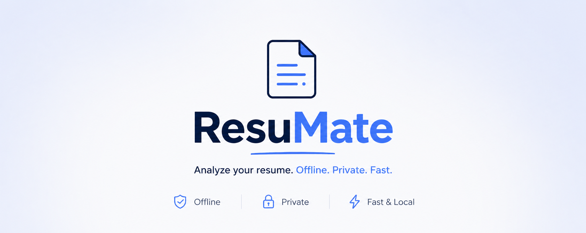

# ResuMate


**A locally running resume tailoring tool powered by the E2B model from the Gemma 4 family of open weights.** Upload your resume once, paste any job description, and get a complete analysis which includes — ATS match score, a cover letter, job description decoder, interview prep, and a tailored rewritten resume. Everything runs on your machine using Gemma 4 via Ollama!

Read more about the features, why I chose the Gemma 4 E2B model and more here: [DEV/ResuMate](https://dev.to/deeptej/i-built-resumate-a-100-private-local-ai-resume-optimizer-with-google-gemma-4-699)

---

## Requirements

- Python 3.8+
- [Ollama](https://ollama.com) with Gemma 4 E2B pulled

---

## Setup

```bash
git clone https://github.com/deeptejd/ResuMate
cd ResuMate

python3 -m venv venv
source venv/bin/activate        # Windows: venv\Scripts\activate

pip install -r requirements.txt
python manage.py migrate
python manage.py runserver
```

In a separate terminal:

```bash
ollama run gemma4:e2b
ollama serve
```

Open `http://localhost:8000` and you should see the dashboard

---

## Configuration

```bash
cp .env.example .env
```

Edit `.env`:

```
OLLAMA_BASE_URL=http://localhost:11434
OLLAMA_MODEL=gemma4:2b
```

**RAM deprived and Running Ollama on a different machine?** Set `OLLAMA_BASE_URL` to that machine's local IP and start Ollama with:

```bash
OLLAMA_HOST=0.0.0.0 ollama serve
```

> Both machines need to be on the same WiFi network.

To find the local IP of that machine, run this on it:

```bash
# Mac or Linux
ifconfig | grep "inet "

# Windows
ipconfig
```

Look for an address starting with `192.168.` or `10.` - that is your local IP. Your .env should then look like:

```
OLLAMA_BASE_URL=http://192.168.x.x:11434
```
